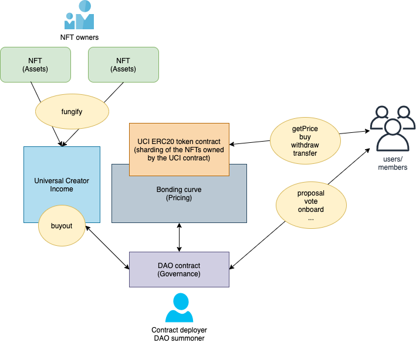

# NFTHack 2021 project

Universal Creator Income: Turn NFTs into a creator economy!

https://hack.ethglobal.co/showcase/universal-creator-income-rect4aqcocaCYXJVK

# Architecture diagram

# Acknowledgement

We greatly appreciate the following open source projects that make this PoC
possible in a few days.

- Hardhat: https://hardhat.org/
- TypeChain: https://github.com/ethereum-ts/TypeChain
- OpenZeppelin:
  https://github.com/OpenZeppelin/openzeppelin-contracts/tree/master/contracts
- Bonding Curve:
  https://github.com/alexanvl/bloccwarz/blob/master/contracts/BloccWarz.sol
- Moloch V3: https://github.com/Moloch-Mystics/moloch-v3
- LoopBack: https://loopback.io/

# Team

We're the team behind [Collab.Land](https://collab.land).

- James Young
- Raymond Feng
- Alok Tiwari
